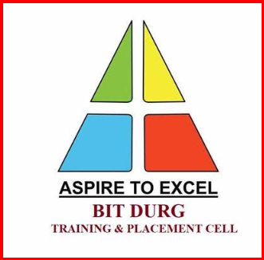

<!DOCTYPE html>
<html lang="en">
<head>
    <meta charset="UTF-8">
    <meta name="viewport" content="width=device-width, initial-scale=1.0">
    <title>BIT Durg College</title>
    <!-- Bootstrap CSS -->
    <link rel="stylesheet" href="https://cdn.jsdelivr.net/npm/bootstrap@4.6.2/dist/css/bootstrap.min.css">
    <link rel="stylesheet" href="https://cdnjs.cloudflare.com/ajax/libs/font-awesome/5.15.4/css/all.min.css">
    
</head>
<body>
    <!-- Header Section -->
    <header class="header">
        
        
        <h1>BIT DURG COLLEGE</h1>
    </header>

    <!-- About Section -->
    <section class="about container text-center">
        <h2>About BIT Durg</h2>
        

            Established in 1986, BIT Durg (Bhilai Institute of Technology, Durg) is a premier institution dedicated to excellence in education, research, and innovation. It is recognized for producing industry-ready professionals and nurturing leaders in technology and management.
        

        <h3>Achievements</h3>
        <ul class="list-unstyled">
            <li><strong>Top Engineering Institution:</strong> Ranked among the top engineering colleges in Central India.</li>
            <li><strong>Innovation Hub:</strong> Over 50 patents filed and several innovative projects recognized at the national level.</li>
            <li><strong>Placement Success:</strong> Consistent record of 90%+ placements in top companies like TCS, Infosys, Wipro, and Accenture.</li>
        </ul>
        <a href="https://docs.google.com/forms/d/e/1FAIpQLSfmXcexHxCwYxz92vJwqkiWzTcUj0v3qRQRLhD6UnFvb6WusQ/viewform?usp=sf_link" class="btn btn-primary" target="_blank">Register for IEEE</a>
    </section>

    <!-- Office Bearers Section -->
    <section class="office-bearers container my-5">
        <h2 class="text-center">Office Bearers</h2>
        

            

                

                    
                    

                        <h5 class="card-title">Dr. John Doe</h5>
                        
Dean, Faculty of Engineering

                        <button class="btn btn-primary" data-toggle="modal" data-target="#facultyModal1">View Profile</button>
                    

                

            

        

    </section>

    <!-- Modals -->
    

        

            

                

                    <h5 class="modal-title">Dr. John Doe - Profile</h5>
                    <button type="button" class="close" data-dismiss="modal">
                        &times;
                    </button>
                

                

                    
                

            

        

    

    <!-- Grievances Section -->
    <section class="grievances container my-5">
        <h2 class="text-center">Grievances & Feedback</h2>
        <form>
            <label for="feedback">Your Feedback</label>
            <textarea id="feedback" class="form-control" rows="4"></textarea>
            <button type="submit" class="btn btn-success mt-3">Submit</button>
        </form>
    </section>

    <!-- Footer -->
    <footer class="text-center py-3 bg-dark text-light">
        © 2024 BIT Durg College. All rights reserved.
    </footer>

    <!-- Bootstrap JS and jQuery -->
    
    
</body>
</html>
